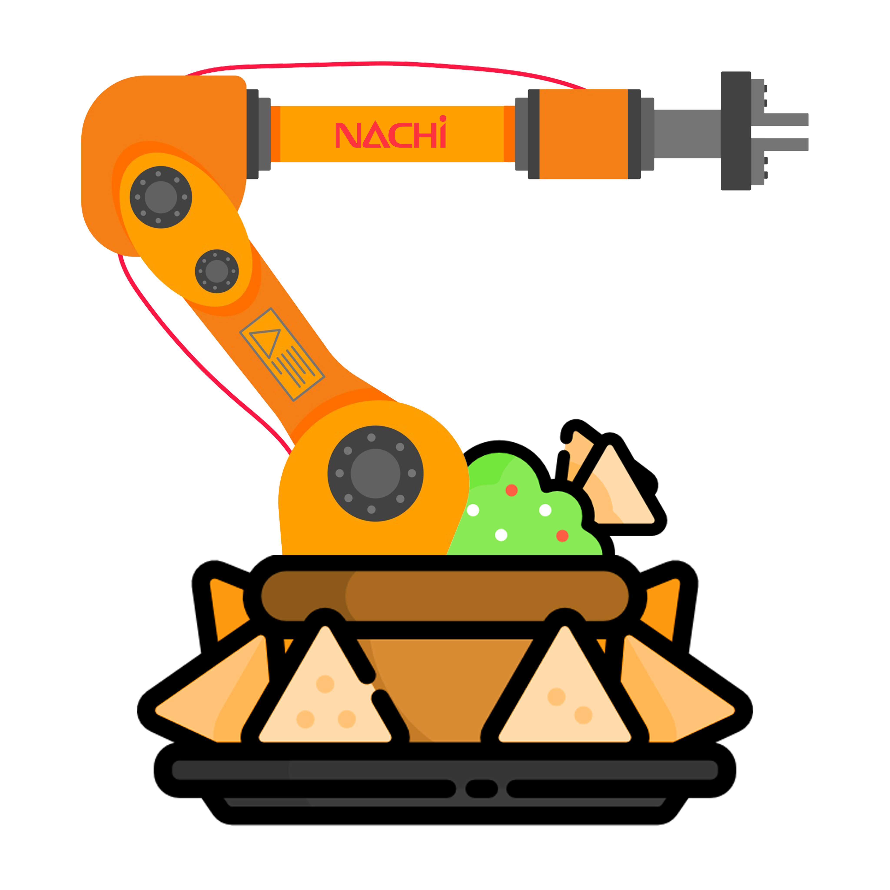
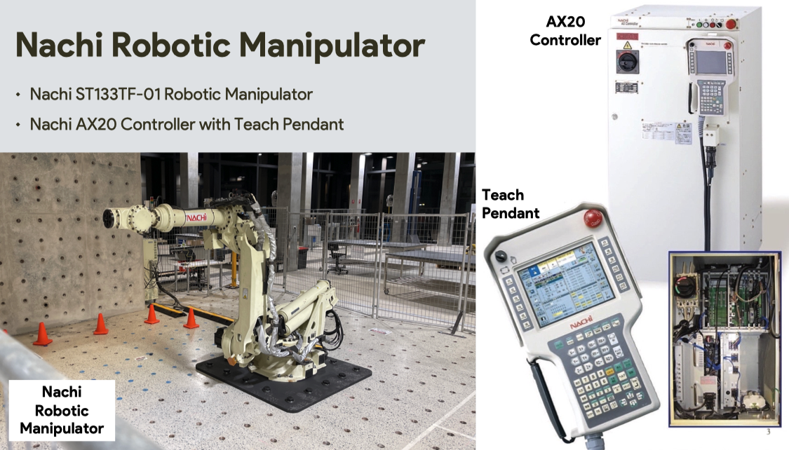
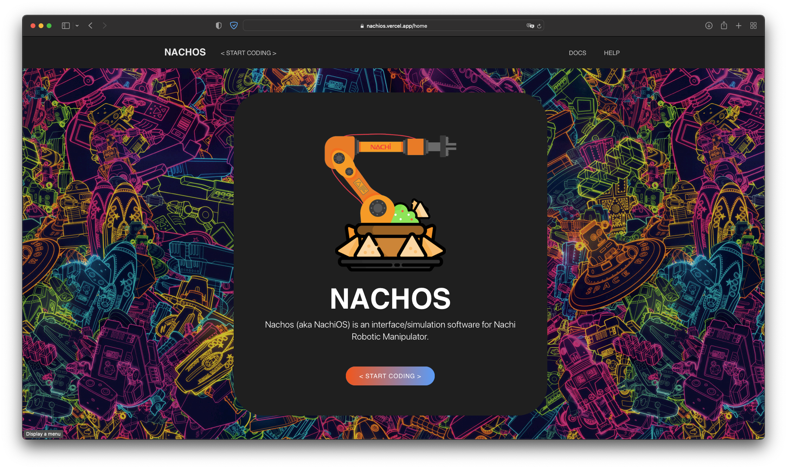
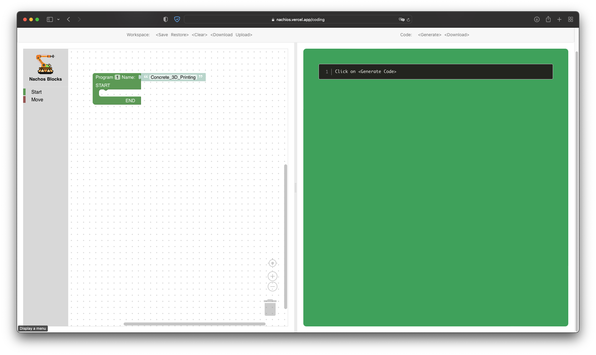
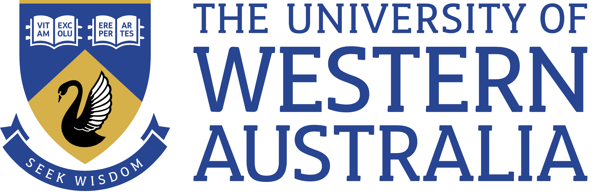
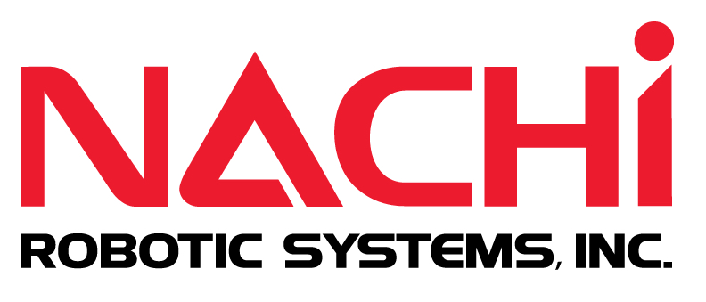

  

# <a href="https://nachios.vercel.app" target="_blank">Nachos</a>

Nachos (or NachiOS) is an interface software for Nachi Robotic Manipulator.

- [Overview](#overview)
- [Nachi System](#nachi-system)
- [Design](#design)
  - [Google's Blockly](#googles-blockly)
- [Development](#development)
- [Special Thanks](#special-thanks)

## Overview 

To provide accessibility and easability to the wide diversity of individuals that may be interested in working with Nachi, 
and due to their wide range of experiences coming from different scientific fields, industries, and backgrounds, 
and due to the current complexities surrounding the operation of Nachi, 
there is a clear need for a simple method of communication. 
There should be clear and well-defined solution for all individuals to be able complete their tasks easily and independently. 
Hence the birth of “Nachos”.

Nachos, also known as NachiOS (Nachi Operation System), is a refined and simple to use interface software. 
Its objectives are to bring together and link Nachi’s internal functionalities into a formal and understandable user interface. 
It aims to provide assistance to all potential users and individuals of Nachi, regardless of their dissimilar set of expertise.

## Nachi System

The Nachi system includes **the Nachi ST133TF-01 Robotics Manipulator** (133 Kg of payload) and **the Nachi AX20 Controller** (with Teach Pendant).

## Design

For its core functionality, Nachos uses: 
1. **React frameworks** and, 
2. **Google's Blockly** 

### Google's Blockly

Block Programming is a visual-based programming language that is designed for individuals with limited programming knowledge and expertise. 
It allows for easy visualisation of all the available features of a language and enables easy drag-and-drop interactivity of blocks for fast and easy development of any program. 
The blocks represent the most fundamental functionality of the language and can be grouped, attached, or nested together to create a larger program or functionality. 
From a specific arrangement and grouping of blocks a program is created. Subsequently, it can be converted to generate a textual representation of all the blocks.

## Development

The development of the Nachos application was made possible through Blockly's various available tools and examples:
1. Blockly Developer Tool ([Blockly Factory](https://blockly-demo.appspot.com/static/demos/blockfactory/index.html))
2. Blockly Samples and Examples ([GitHub](https://github.com/google/blockly-samples)) 

# Special Thanks:

- **Professor Thomas Braunl**

 

